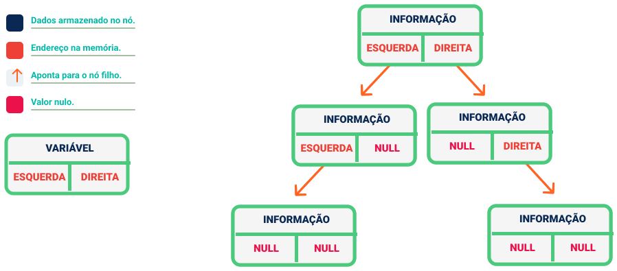

#  Árvore Binária em linguagem C

## Selecione o Idioma / Select the language:

### Idioma/language:

1.  [Português](#Português)

2.  [English](#English)

---
### Documentação do projeto / project documentation:

3. [Docs.](docs/indice.md#-índice-)


## Português

#### ``@author João Paulo``, Link para executar o projeto no [replit.com](https://replit.com/@JooPaulodaSilv1/Arvore-binaria-Implementacao).

Este projeto implementa uma árvore binária para tipos genéricos, no qual se usa de um tipo ``address`` declarado na biblioteca ``types.h``, este tipo equivale a um ponteiro do tipo vazio ``void *``, ou tipo declarado neste arquivo de cabeçalho é o tipo ``string``, no qual é equivalente a ``char *``.

---

### Árvore Binária

Uma árvore binária é uma estrutura de dados caracterizada por: Ou não tem elemento algum. Ou tem um elemento distinto, denominado raiz, com dois ponteiros para duas estruturas diferentes, denominadas subárvore esquerda e subárvore direita. [Wikipédia](https://www.google.com/url?sa=t&rct=j&q=&esrc=s&source=web&cd=&cad=rja&uact=8&ved=2ahUKEwj1zafB-Pj3AhUaK7kGHbm-DCYQmhN6BAhWEAI&url=https%3A%2F%2Fpt.wikipedia.org%2Fwiki%2F%25C3%2581rvore_bin%25C3%25A1ria&usg=AOvVaw0qT_P5p18LdeLCRggL-CKi)



---

### **Decisões para a interface no terminal.** 

A interface deste projeto utiliza caracteres especiais para a formulação dos menus, também de métodos para o posicionamento no terminal e verificação se as teclas são pressionadas. 

---

#### **Menu Inicial.**

Na tela inicial existem dois métodos para sua navegação, sendo elas: as setas do teclado ou os números de 1 a 4, após selecionar uma opção só apertar a tecla enter para entrar na opção.


---

#### **Inserir Produtos.**

Nessa tela é possível a inserção de produtos na árvore podendo inserir 1 ou vários produtos, os produtos não serão inseridos se houver o mesmo código.


---

#### **Lista Produtos.**

Nesta tela pode-se navegar pela árvore usando as setas do teclado para a esquerda e direita, mostrando o botão em cinza claro se não houver filho no nó.


---

#### **Buscar Produtos.**

A opção de buscar produtos abre um novo menu, no qual pode se optar por buscar via nome ou código.


---

#### Nó 

O nó de uma árvore binária caracteriza-se por possuir um o valor que o nó armazena e o endereço para seus filhos (*esquerda e direita*), como no exemplo abaixo com número inteiro:

```C
// Definição de uma estrutura para ser o tipo nó da árvore.
typedef struct NODE{
  int valor; // Valor armazenado.
  struct NODE * esquerda; // Filho a esquerda.
  struct NODE * direita;  // Filho a esquerda.
}no;
```

---

#### Árvore binária usando o tipo acima:

```C
typedef struct TREE{
  no * raiz;
}Tree;
```
A implementação é simples, como visto acima, para ajudar na navegação, pode se colocar o nó atual na árvore também para facilitar as operações de navegação na árvore.

```C
typedef struct TREE{
  no * raiz;
  no * atual;
}Tree;
```