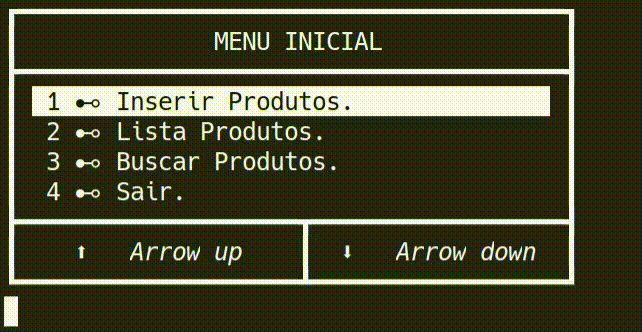

#  Árvore Binária em linguagem C

## Selecione o Idioma / Select the language:

### Idioma/language:

1.  [Português](#Português)

2.  [English](#English)

---
### Documentação do projeto / project documentation:

3. [Docs.](docs/indice.md#-índice-)

## Português

#### ``@author João Paulo``, Link para executar o projeto no [replit.com](https://replit.com/@JooPaulodaSilv1/Arvore-binaria-Implementacao).

Este projeto implementa uma árvore binária para tipos genéricos, no qual se usa de um tipo ``address`` declarado na biblioteca ``types.h``, este tipo equivale a um ponteiro do tipo vazio ``void *``, ou tipo declarado neste arquivo de cabeçalho é o tipo ``string``, no qual é equivalente a ``char *``.

---

### Decisões para a interface no terminal. 

A interface deste projeto utiliza caracteres especiais para a formulação dos menus, também de métodos para o posicionamento no terminal e verificação se as teclas são pressionadas. 

#### Menu Inicial.

Na tela inicial existem dois métodos para sua navegação, sendo elas: as setas do teclado ou os números de 1 a 4, após selecionar uma opção só apertar a tecla enter para entrar na opção.

#### Inserir Produtos.

#### Lista Produtos.

#### Buscar Produtos.

